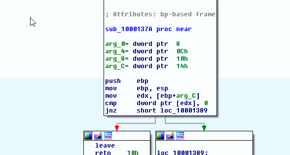
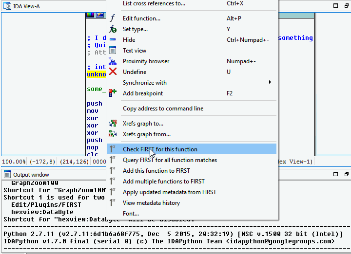
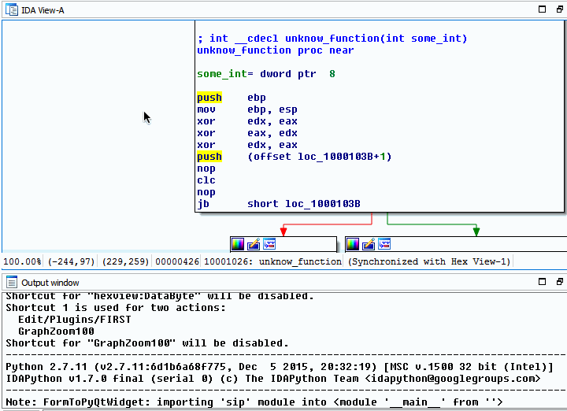

.. _ida-adding:

==================
Adding Annotations
==================
To add your own annotations for a function or several functions to FIRST you can use the right click menu in the IDA View window. Simply right click anywhere in the IDA View window and select **Add this function to FIRST** or **Add multiple functions to FIRST**.

    FIRST's IDA Integration Right Click Menu

Adding a Single Function
========================
To add a single function, right click any where within the IDA View window of a valid function.

.. note::

    A valid function is a function that IDA Pro was able to interpret as a function. If you are viewing disassembly in Graph mode them anywhere in the window will is valid. However, if you are viewing disassembly in Text mode then the address corresponding to the instruction selected should be associated with a function (this is indicated by the black color instruction address' text).

Once the popup menu is shown, select **Add this function to FIRST**. The Add function metadata dialog box will pop up with the annotations associated with the function. The annotations cannot be modified in this dialog box, it is only for review purposes. If the annotations need to be changed then close the dialog box and update the function in IDA and add the function once the function annotations are to your liking. After reviewing the annotations select the **Upload** button. If no errors occured your function annotations will be added to FIRST and the Output window will state how many functions were added to FIRST.

    Add a Single Function to FIRST

Adding Multiple Function at Once
================================
To add multiple functions, right click any where within the IDA View window. Once the popup menu is shown, select **Add multiple functions to FIRST**. The Mass Function Upload dialog box will pop up with a list of a majority, if not all, functions defined in IDA Pro.

.. note::

    FIRST skips any function that is a wrapper for a jmp instruction.

    .. code::

        .text:100023C5 sub_100023C5    proc near
        .text:100023C5                 jmp     short loc_100023D6
        .text:100023C7 sub_100023C5    endp

The dialog box uses a couple of different colors to signify various properties associated with a given function, its state or changes in its metadata.

.. list-table::
    :header-rows: 1

    * - Color Property
      - Meaning
    * - Changed
      - The function's metadata has changed. This will apply in a couple of situations; [1] if the function previous had metadata from FIRST applied to it but you changed it in some way; [2] You've uploaded your annotations to FIRST and then altered them in IDA without adding again, [3] not metadata is associated with the function and you added your annotations. These functions, most likely, should be added to FIRST.
    * - Unchanged
      - The function's metadata has not changed from the last metadata applied to it. This is reserved for functions that have metadata applied to it. If no metadata is applied to the function then it will likely show up as Default.
    * - Default
      - The function's metadata has not been altered from IDA Pro's auto analysis. This will apply to all functions with the **sub_** prefix and Library functions detected by IDA's FLIRT signatures.
    * - Selected
      - The function has been selected to be added to FIRST. To select a function, just click on it in the list of function. To deselect a function, clikc on it once more.

The dialog box also provides a way to quickly filter out any function starting with **sub_** and to select all functions displayed in the list. Simply select the checkbox associated with the operation you wish and the function list will be updated to reflect it.

.. note::

    Selecting **Filter Out "sub_" functions** and **Select All** in either order will cause only the function not starting with **sub_** to be selected.

After reviewing your selection, select the **Upload** button. If no errors occured your function(s) annotations will be added to FIRST and the Output window will state how many functions were added to FIRST.

    Add Multiple Functions to FIRST

Data Collected and Sent to FIRST
================================
Through IDA Pro's IDA Python APIs FIRST will retrieve several bits of information for the function to send back to the server. The information will be used by the system to uniquely identify the function and supply Engines with enough information to execute their algorithms. The data sent sent can be found below

.. list-table:: Data sent to FIRST server
    :header-rows: 1

    * - Data
      - Description
    * - Function Name
      - Reverser's created annotation.
    * - Function Prototype
      - Reverser's created annotation.
    * - Function Repeatable Comment
      - Reverser's created annotation. This is the repeatable function comment
        (key press: ;), not a function comment (key press: Shift + ;)
    * - Opcodes
      - All the opcodes assocaited with the function. The opcodes are retrieved
        in order of lowest address to highest address. This is based off of IDA's
        ability to determine function boundries by its basic blocks
    * - Architecture
      - The architecture the function is executed on (i.e. intel32, intel64,
        arm32, etc.)
    * - IAT Function Calls
      - The functions called from this function that are exports from other
        samples and in the samples IAT.
    * - Sample's MD5
      - The MD5 of the sample, IDA calculates this when the sample is initially
        loaded. The original sample is not required and the MD5 is retrieved
        through IDA's API.
    * - Sample's CRC32
      - The CRC32 of the sample, IDA calculates this when the sample is initially
        loaded. The original smaple is not required and the CRC32 is retrieved
        through IDA's API.
