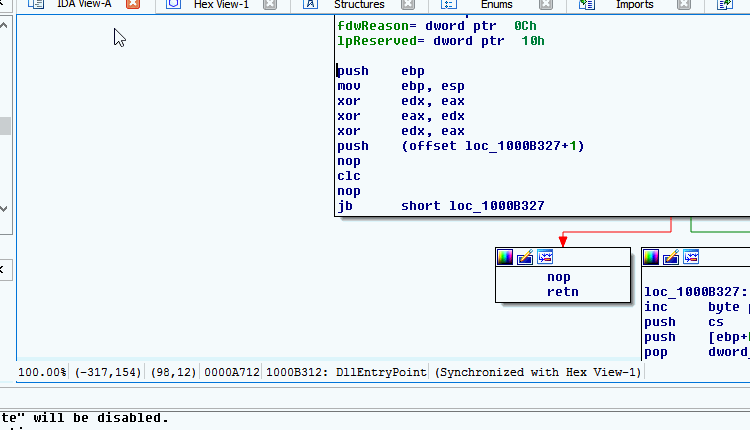
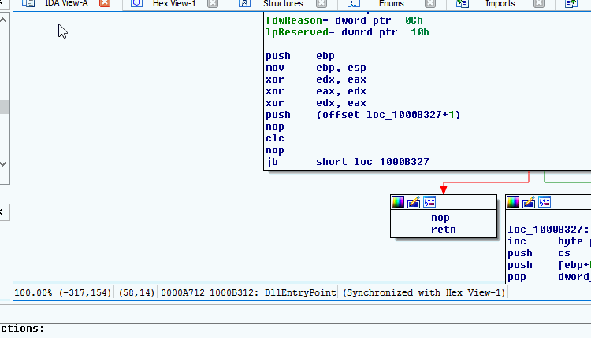

.. _ida-checking:

ARCHIVED PROJECT
================

THIS PROJECT HAS BEEN ARCHIVED AND ITS ISSUE QUEUE IS LOCKED. THE PROJECT WILL BE KEPT PUBLIC ONLY FOR REFERENCE PURPORSES.

========================
Checking for Annotations
========================

To check for a single or all functions in your IDB, you can use the right click menu in the IDA View window. Simply right click anywhere in the IDA View window and select **Check FIRST for this function** or **Query FIRST for all function matches**.

.. figure:: _static/images/ida_view_right_click_popup.gif
    :align: center
    :alt: FIRST's IDA Integration Right Click Menu

    FIRST's IDA Integration Right Click Menu

The dialog boxes associated with querying FIRST for one or all functions are similar in a lot of ways. Both use two colors to signify if the match is currently applied and what match is selected.

.. list-table::
    :header-rows: 1

    * - Color Property
      - Meaning
    * - Applied
      - The match is currently applied to the function it is a match for. This does not mean your local IDB is synced up with the latest version of the metadata associated with the match. Selecting it again will ensure the latest annoations are applied to your IDB
    * - Selected
      - The function has been selected to be added to FIRST. To select a function, just click on it in the list of function. To deselect a function, clikc on it once more.

Query for Single Function
=========================
To check FIRST for a single function, right click any where within the IDA View window of a valid function.

.. note::

    A valid function is a function that IDA Pro was able to interpret as a function. If you are viewing disassembly in Graph mode them anywhere in the window will is valid. However, if you are viewing disassembly in Text mode then the address corresponding to the instruction selected should be associated with a function (this is indicated by the black color instruction address' text).

Once the popup menu is shown, select **Check FIRST for this function**. The Check Function dialog box will pop up and any matches (exact or similar) will be displayed in a tree structure.

    Query FIRST for Single Function

Query for All Functions
=======================
To query FIRST for all functions in the IDB, right click any where within the IDA View window. Once the popup menu is shown, select **Query FIRST for all function matches**. The Check all Functions dialog box will pop up with a list of matches for functions within the IDB. While results are being populated, you can go through an look at each match.

The tree view is used to display the data in a meaniful way. The top most layer shows the address and current function name the matches correspond to. The next column displays the number of matches to that function. Expanding that node will show the matches and their details. Selecting to expand a match node will display the comment associated with that match.

.. note::

    Selecting **Show only "sub_" functions** and **Select Highest Ranked** in either order will cause only the function starting with **sub_** to be selected.

    FIRST will not query for all functions at once. Instead all functions are grouping in sets of 20 and each set is set to the server. This will allow results to be returned and the researcher to start looking over the results. As new matches are returned the data will be added.

To help understand if the match makes sense, right click anywhere within the function tree node or its matches, and click **Go to Function**. This will focus the last used IDA View window on the function in question.

After reviewing your selection, select the **Apply** button. If no errors occured the selected matches will be applied to your function(s) and the Output window will state how many functions were applied with FIRST annotations.

.. important::

    If multiple functions attempt to apply the same match, then only the function first applied with the annotations will change. IDA Pro will prompt you with each additional function that the metadata cannot be applied to. The Output window will display the addresses of the functions that metadata couldn't be applied to.

.. danger::

    Selecting to apply annotations to your functions will overwrite any annotations currently applied. There is no UNDO for this operation. Also, when applying a function metadata to your IDB's function, this could result in incorrect function prototypes (for similar and possibly exact matches).

    Query FIRST for All Functions
