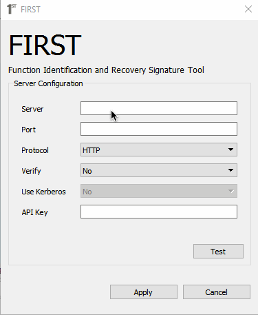
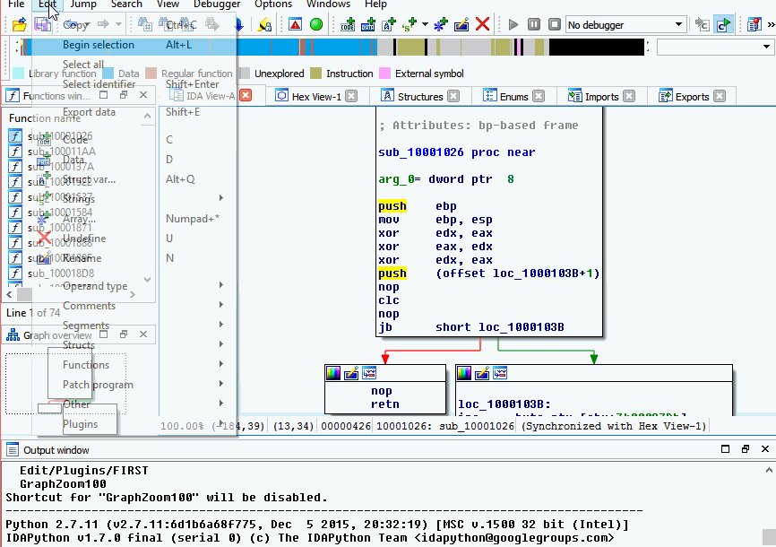

.. _ida-configuring:

===========
Configuring
===========
FIRST plugin can be configured in three ways; the Welcome dialog box when initially installed, the plugin main window and manually modifying the config file (no recommend for most).

Initial Installation
====================
When FIRST is initially installed and IDA is loaded a *Welcome* dialog box will appear. This only appears when FIRST is not configured.

**Notice: public server moved to first.talosintelligence.com:443.**

    FIRST welcome dialog box (with invalid API key)

The configuration requires a valid API key that can be obtained from the server (go to first.talosintelligence.com to register with public server). Make sure to test the connection and select **Save**

Plugin Main Window
==================
To access the plugin's main window, users can either press **1** from a IDA Pro View window or by the IDA Pro Edit menu (Edit > Plugins > FIRST). Once the main window is open select the **Configuration** tab from the left panel. From here the connection details can be updated. Selecting the **Test** button will test if a connection to FIRST can be made. However, it does not save and use that server connection until the **Save** button is selected.

    FIRST Server Configuration (with invalid API key)
