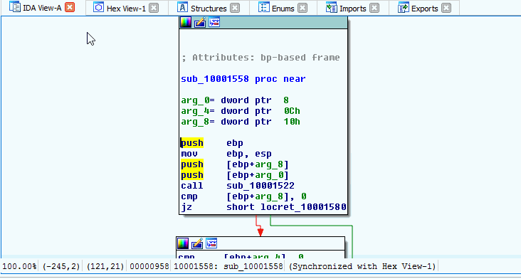

.. _ida-currently-applied:

ARCHIVED PROJECT
================

THIS PROJECT HAS BEEN ARCHIVED AND ITS ISSUE QUEUE IS LOCKED. THE PROJECT WILL BE KEPT PUBLIC ONLY FOR REFERENCE PURPORSES.

=================
Currently Applied
=================

Some times during analysis it can be very useful to know what annotations from FIRST where applied to the IDB. Additionaly, it could help quickly track down some functionality of interest. To aid in this, a user can go to the main FIRST plugin in window (press **1** from the IDA View window or through IDA Pro's menus: **Edit** > **Plugins** > **FIRST**). Once at the main FIRST plugin window, select the **Currently Applied** tab from the left panel.

    Go to Function from Currently Applied
