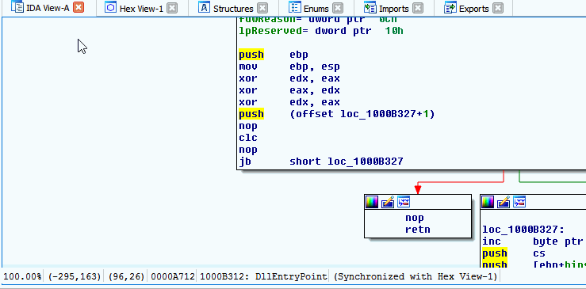

.. _ida-deleting:

=========================
Deleting Your Annotations
=========================

.. important::

    It is important to note you can only delete annotations you've created. Applying someone else's annotations to a function and modifying it will make a new annoations tied to you and not the original creator.

To manange the annotations you've created and have added to FIRST open the FIRST plugin main window. To access the plugin's main window, users can either press **1** from a IDA Pro View window or by the IDA Pro Edit menu (Edit > Plugins > FIRST). Once the main window is open select the **Management** tab from the left panel. The plugin will query the server for all metadata you have added. This data will be populated in a tree view to allow you to view an organized list of your metadata. To delete an annotation, either right click and select **Delete** or press the Delete key.

    Query FIRST for All Functions
