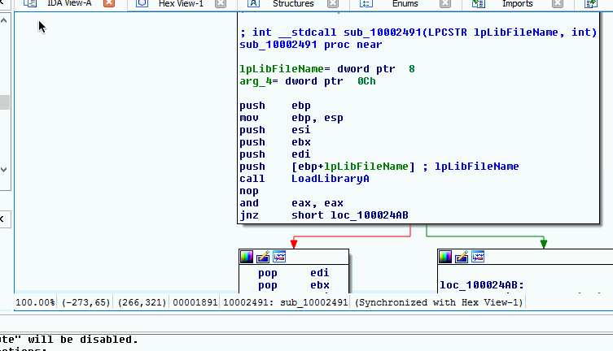
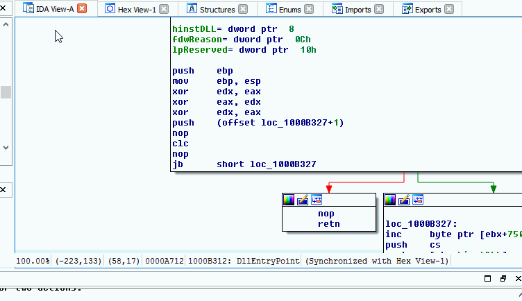
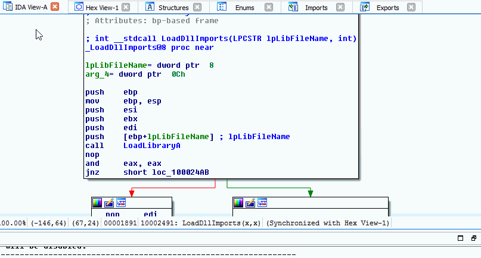
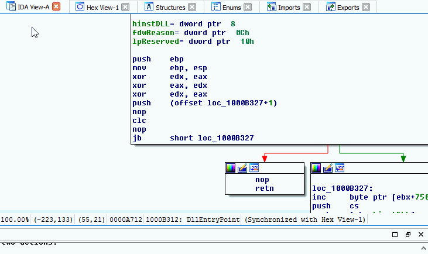
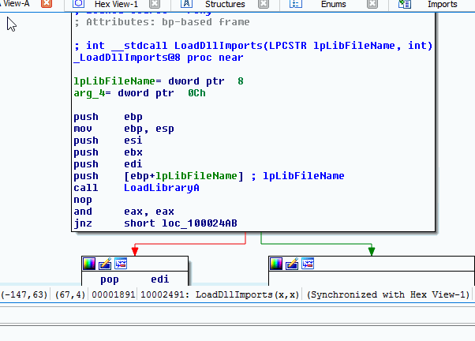

.. _ida-view-history:

ARCHIVED PROJECT
================

THIS PROJECT HAS BEEN ARCHIVED AND ITS ISSUE QUEUE IS LOCKED. THE PROJECT WILL BE KEPT PUBLIC ONLY FOR REFERENCE PURPORSES.

=====================
View Metadata History
=====================
The history for metadata can be viewed in several different places.
- A match in a Query FIRST operation (Check Function or Check All Functions dialog box)
- The management and currently applied view of the main FIRST plugin window
- A function with FIRST metadata applied from the IDA View window via the right click menu

The Check Function/Check All Functions dialog boxes and Currently Applied/Management views use a tree structure to display function annotations. Right click anywhere within the record for an annotation to open the popup menu. In this menu select the **View History** operation and a new dialog box will open up displaying the revisions made to the annotations by the original author.

    View History from Check Function Dialog Box

    View History from Check All Functions Dialog Box

    View History from Currently Applied View

    View History from Management View

When annotations from FIRST are applied to a function, a new right click menu option becomes available. The **View metadata history** operation will open a dialog box with the revision history.

    View History from Function with FIRST Annotations
